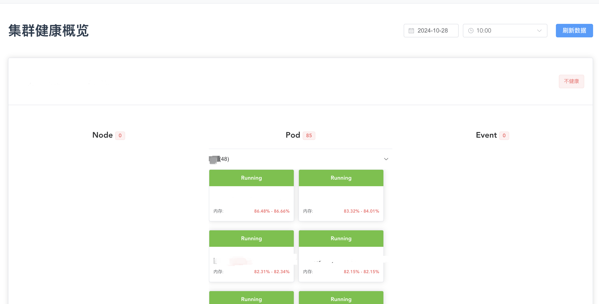
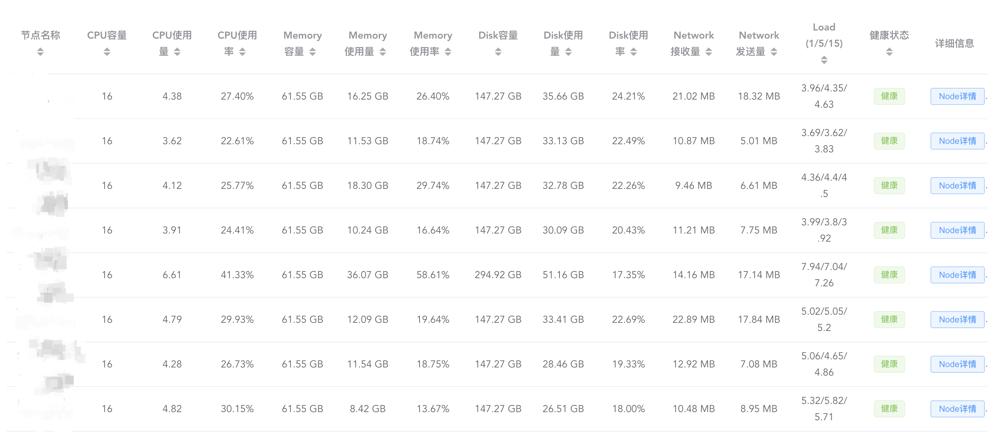

# 集群巡检系统

使用kubeconfig连接集群并进行巡检的程序

使用mysql存储

展示的截图为另外一个前端项目，有需要可以配合使用 [cluster-inspection-vue](https://github.com/SweetEriri/cluster-inspection-vue)

```yaml
clusters:
  - name: production-cluster
    kubeconfig: ./production-cluster.yaml
    #保证网络连通
    prometheus: http://127.0.0.1:9091
    #如果需要使用token则填入，否则为空
    prometheus_token: ""
    ClusterName: ""

  - name: staging-cluster
    kubeconfig: ./staging-cluster.yaml
    prometheus: http://127.0.0.1:9090
    prometheus_token: ""
    ClusterName: ""
database:
  user: ""
  password: ''
  host: ""
  port: ""
  dbname: ""
```

## 配合前端展示

- 概览



- 节点


